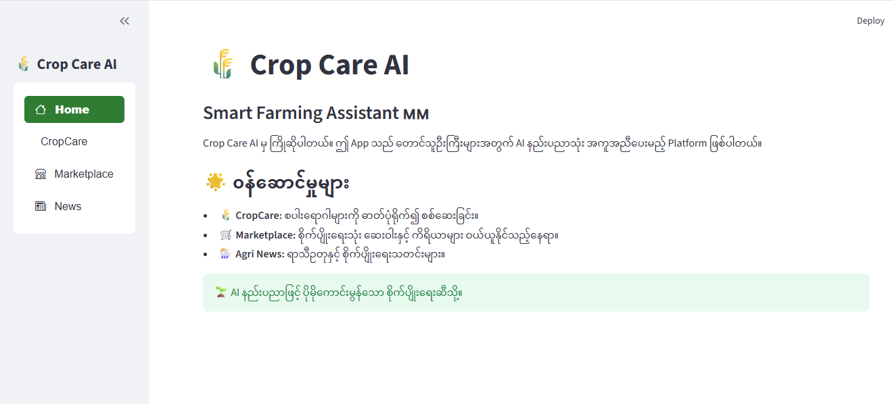
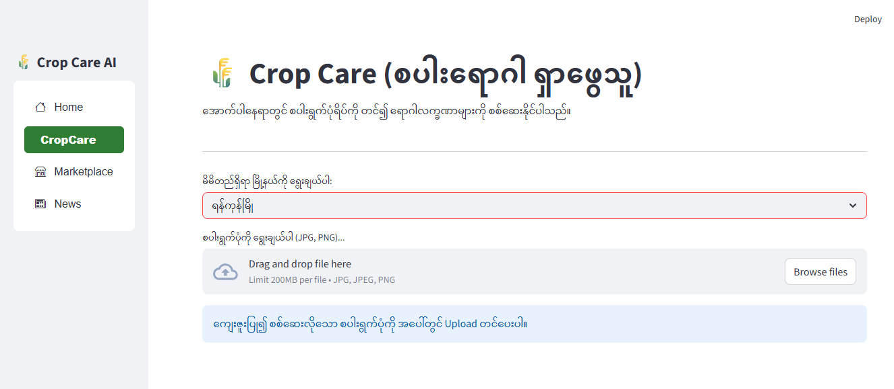
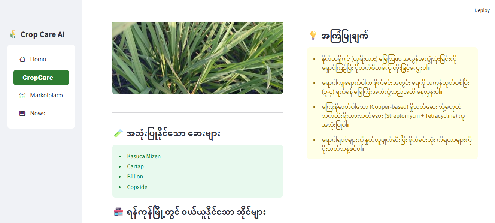
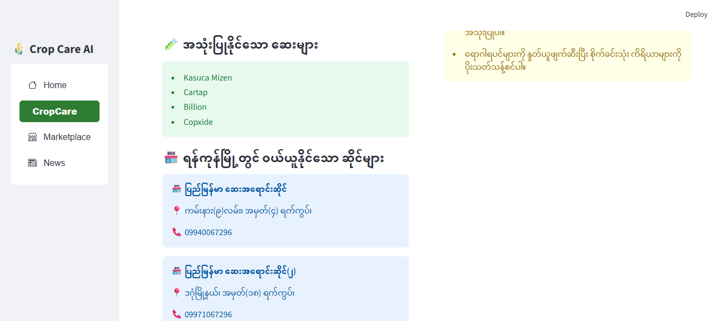
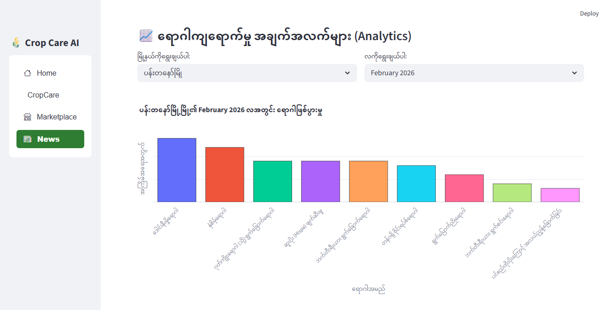
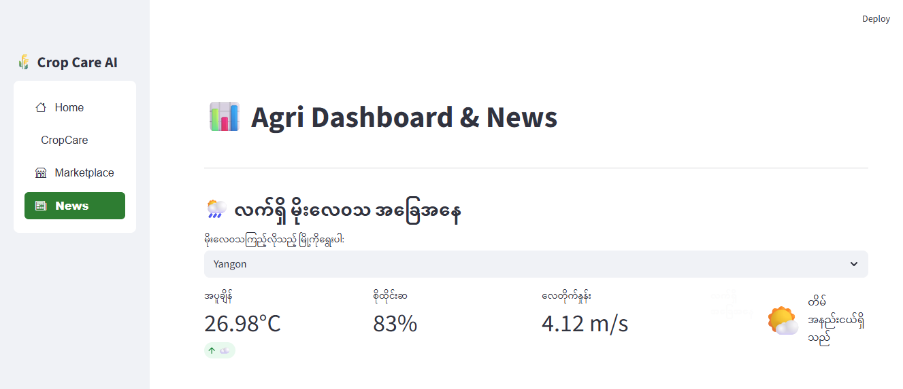
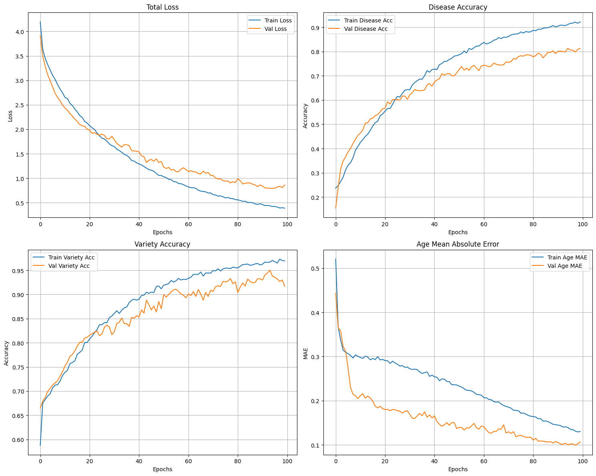

# 🌾 Crop Care AI - Smart Farming Assistant

**Crop Care AI** is an AI-powered platform designed to assist Myanmar farmers in identifying rice diseases, monitoring weather conditions, and accessing agricultural resources all in one place.

## Features of the Platform

### Crop Care AI 🤖

The heart of the system is designed for **maximum convenience**. Farmers no longer need to manually identify pests; they only need a single photo to get a complete solution.

#### How it works:

- **Simple Input:** Select city and upload a photo of the affected paddy leaf.
- **AI Analysis:** System instantly diagnoses the disease, explains the root cause, and provides a detailed treatment plan in Burmese.
- **End-to-End Solution:** It doesn't just stop at a diagnosis—it recommends specific **usable drugs** and automatically finds **nearby agro-shops** in user's city that stock those exact items.

  
  
  

- **🛠️ Integrated Marketplace:** Automatically filters local shops based on the required chemical treatments.

  

### Community Trends (Analytics) 📊

Visualizes disease outbreaks in the cities to help with regional prevention and planning.

### Smart Weather Insights 🌦️

Real-time weather monitoring with AI alerts for irrigation and pesticide spraying schedules.

## Tech Stack

### Multi-Output Deep Learning Model 🧠

System utilizes a customized MobileNetV2 architecture, specifically designed for efficient performance on mobile and web platforms. Unlike standard models, Crop Care AI features a unique Multi-Task Learning head that can simultaneously predict three critical factors from a single image:

- **Disease Classification:** Identifies the specific type of paddy disease with high precision using Softmax activation.

- **Variety Recognition:** Detects the rice variety (e.g., ADT 45, Pusa) to provide more contextual farming advice.

- **Crop Age Estimation:** Predicts the growth stage (in days) using a Linear regression output, helping farmers track crop maturity.

- **Training Result**

